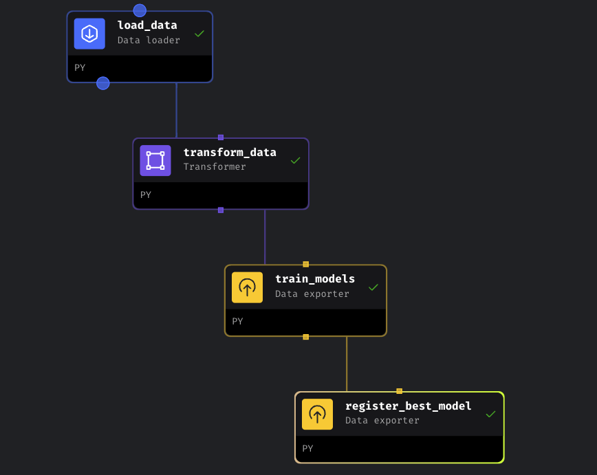
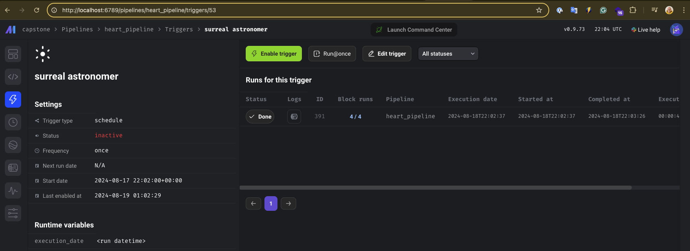
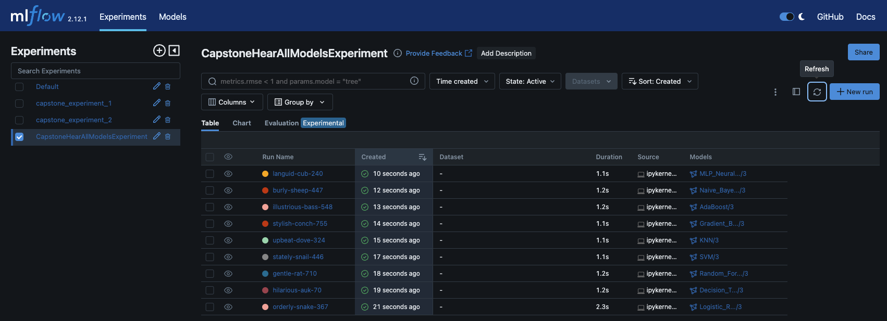
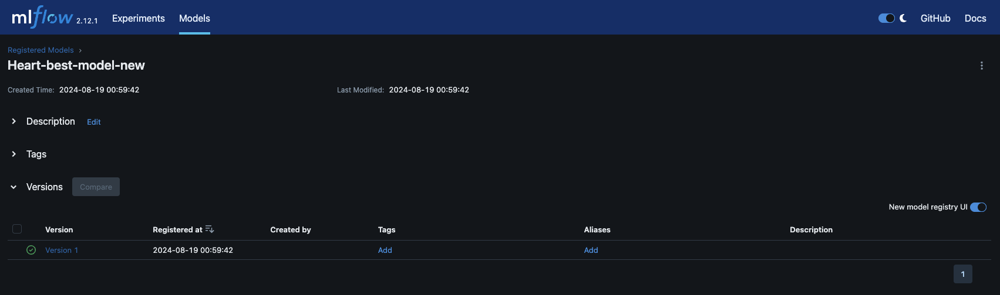
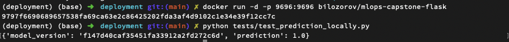
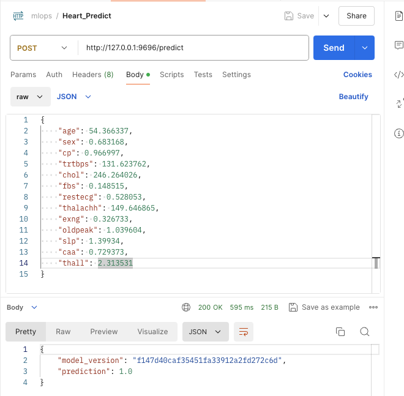
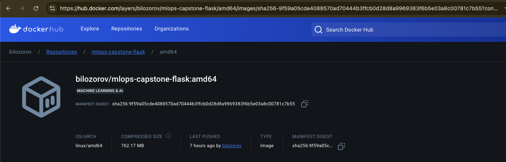

# MLOPS Capstone Project – Heart Attack Analysis & Prediction

## Problem Descriptions

Cardiovascular diseases, particularly heart attacks, are a leading cause of death globally. Early and accurate prediction of heart attack risk is crucial for improving patient outcomes. The **Heart Attack Analysis & Prediction Dataset** includes 303 records with features like age, cholesterol levels, and chest pain type, which can be used to train machine learning models for predicting heart attack risk. This project aims to develop a predictive tool to assist healthcare professionals in identifying high-risk patients early, enabling timely interventions and potentially saving lives.

## Dataset Descriptions

1. **age**: Age of the patient (in years).
2. **sex**: Gender of the patient (1 = Male, 0 = Female).
3. **cp**: Chest pain type:
   - 0: Typical angina
   - 1: Atypical angina
   - 2: Non-anginal pain
   - 3: Asymptomatic
4. **trtbps**: Resting blood pressure (in mm Hg).
5. **chol**: Serum cholesterol level (in mg/dl).
6. **fbs**: Fasting blood sugar (1 = Fasting blood sugar > 120 mg/dl, 0 = Fasting blood sugar ≤ 120 mg/dl).
7. **restecg**: Resting electrocardiographic results:
   - 0: Normal
   - 1: Having ST-T wave abnormality
   - 2: Showing probable or definite left ventricular hypertrophy
8. **thalachh**: Maximum heart rate achieved.
9. **exng**: Exercise-induced angina (1 = Yes, 0 = No).
10. **oldpeak**: ST depression induced by exercise relative to rest.
11. **slp**: Slope of the peak exercise ST segment:
    - 0: Upsloping
    - 1: Flat
    - 2: Downsloping
12. **caa**: Number of major vessels (0–3) colored by fluoroscopy.
13. **thall**: Thalassemia status:
    - 0: Normal
    - 1: Fixed defect
    - 2: Reversible defect
14. **output**: Target variable indicating the presence of heart disease (1 = Heart disease, 0 = No heart disease).

## Tech Stack
- **MLflow**: Experimet tracking
- **Mage**: Orchestration
– **Docker**: Containerization  
- [TBD] **AWS RDS**: MLflow tracking database
- [TBD] **AWS Lambda**: Running the training and inference code
- [TBD] **AWS EFS**: Storing data
- [TBD] **Evidently**: Monitoring data drift and model performance
- [TBD] **Grafana**: Interactive visualization
- [TBD] **Pytest**: Testing code

## Reproduction

### Prerequisites

- Python 3.11+
- Docker (for local testing and deployment)

### General
```
mkdir project

cd project

git clone https://github.com/bilozorov/mlops-capstone.git
```

### Workflow Orchestration with Experiment Tracking

```
cd orchestration/

./scripts/start.sh

```

Mage: http://localhost:6789

MLflow: http://localhost:5001 (not a 5000, MacOS dependent)

Pipeline orchestration via Mage with MLflow:
- **load_data**: read data from csv file
- **transform_data**: use StandardScaler to transform data
- **train_models**: train 9 model, log Accuracy and MSE to Mflow and log model+scaler to MLflow
- **register_best_model**: choose model from MLflow with minimal MSE (metrics.test_rmse ASC) 









### Deploy model locally with Docker

```
cd deployment

pipenv shell

docker build -t bilozorov/mlops-capstone-flask .

docker images

docker run -d -p 9696:9696 bilozorov/mlops-capstone-flask

python tests/test_prediction_locally.py
```





### Deploy docker image to the Docker Hub

```
cd deployment

pipenv shell

docker build --platform linux/amd64 -t bilozorov/mlops-capstone-flask .

docker images

docker tag bilozorov/mlops-capstone-flask bilozorov/mlops-capstone-flask:amd64

docker push bilozorov/mlops-capstone-flask:amd64

```
https://hub.docker.com/layers/bilozorov/mlops-capstone-flask/amd64/images/sha256-9f59a05cde4088570ad70444b3ffcb0d28d8a9969383f6b5e03a8c00781c7b55?context=repo


